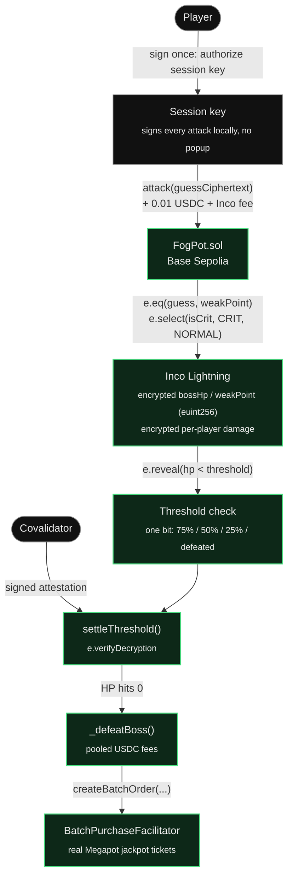

# FogPot

**A hidden boss. A shared jackpot. Every hit is a secret until the fog lifts.**

FogPot is a confidential boss-raid game built for the **Inco Summer Game Jam**. A shared boss lives onchain with its HP and weak point fully encrypted — nobody, not the players, not the contract deployer, not anyone watching the chain, can read them. Players pay a small USDC fee to land a blind attack, hoping to guess the hidden weak point for a critical hit. When the boss falls, every fee ever paid in gets batch-converted into real [Megapot](https://megapot.io) jackpot tickets, split across raiders by the damage they dealt.

It's a raid boss, a slot machine, and a lottery pool, wired together through confidential compute.

---

## How it works

1. **Sign in once, attack freely.** Connect a wallet and authorize a throwaway session key with a single signature. Every attack after that is signed by the session key locally — no MetaMask popup per hit.
2. **Attack blind.** Pay 0.01 USDC and submit an encrypted guess at the boss's hidden weak point. Guess right for a critical hit, guess wrong for normal damage — only you can ever decrypt which one you got.
3. **The fog lifts in bits, not numbers.** Boss HP and its weak point stay encrypted onchain via [Inco Lightning](https://docs.inco.org). The public only ever learns single-bit milestones — HP crossed 75% / 50% / 25% / defeated — never the exact HP or the damage that caused it.
4. **The pool pays out.** When the boss falls, every USDC paid in gets batch-converted into real Megapot tickets via `BatchPurchaseFacilitator`, split by damage contribution.

No mocked reward, no simulated payout, no link-out — boss defeat triggers a live ticket purchase on Base.

## Architecture



## Why it's confidential

Most onchain "hidden information" games fake it — the state is public, only the UI hides it. FogPot's boss HP, weak point, and per-player damage are genuinely encrypted contract state:

- **Encrypted HP & weak point** — stored as `euint256`/`ebool` via Inco Lightning. Attacks compare an encrypted guess against the encrypted weak point (`e.eq`) and compute crit-vs-normal damage (`e.select`) without ever decrypting either.
- **Private per-player damage** — each raider's cumulative damage is a private `euint256` that only that raider is ever granted access to decrypt (`allow(msg.sender)`). Nobody else — not other raiders, not the deployer — can see who's dealing how much.
- **One-bit threshold reveals** — going public with "HP crossed 25%" is a genuinely async operation: the contract requests a decryption of a single boolean (`e.reveal`), and a covalidator-signed attestation later settles it (`settleThreshold` + `e.verifyDecryption`). Nothing about exact HP or exact damage is ever exposed.
- **One shared pool** — every attack fee across every raider joins a single USDC pool. You're not grinding solo; the whole raid party wins together when the boss falls.

## Multiplayer

FogPot is one shared boss, not per-player instances — everyone who opens `/raid` is fighting the same fight, and it's the real deployed `FogPot` contract on Base Sepolia that holds that shared state, not a server. The frontend polls the contract directly every 4s (`revealedHpPct`, `bossDefeated`, `pooledFees`, `getAttackers`), so two browsers (or two thousand) watch the same onchain HP bar drop in real time.

## Attacking onchain

Every attack on `/raid` is a real transaction against the deployed `FogPot` contract. After the one-time USDC approval, you sign **one more thing** — a session authorization — and every attack after that needs no wallet popup at all:

1. One-time `USDC.approve()` for the contract, if your allowance is too low.
2. One-time (per hour) **session authorization**: your wallet signs an EIP-712 `SessionAuth(owner, sessionKey, expiresAt)` message authorizing a freshly generated burner keypair (kept in `sessionStorage`, never leaves your browser) to attack on your behalf. This key can only ever call `attackFor()` — it cannot move funds or change your USDC approval.
3. Every attack from then on: a blind guess (`[0, 3)`) is encrypted client-side via `@inco/js`, and the burner session key signs an EIP-712 `Attack(owner, sessionKey, nonce)` message locally — instant, no wallet interaction. The frontend POSTs both signatures to `/api/boss/attack`, which relays `attackFor(player, guessCiphertext, sessionKey, expiresAt, authSignature, nonce, attackSignature)` onchain, paying gas and the Inco per-op fee itself. `FogPot.sol` verifies both signatures onchain and pulls the 0.01 USDC fee straight from **your** wallet via the allowance from step 1 — the relayer never custodies funds, it only submits the transaction. The spend shows up in your wallet's transaction history same as any other transfer, you just don't click "confirm" for it.
4. If that attack (or someone else's) left a threshold check pending, `/api/settle` fetches the covalidator-signed attestation for it (`lightning.attestedReveal`) and calls `settleThreshold` — permissionless, so whoever gets there first can advance the public HP bucket. `/raid` retries this automatically on every poll tick while a check is pending, so HP catches up on its own once Inco's decryption oracle network is reachable (it's a real testnet dependency — see the note below if HP looks stuck).
5. Your own cumulative damage stays encrypted; hit "REVEAL MY DAMAGE" to sign an authorization (`lightning.attestedDecrypt`, no gas) and decrypt just your own `encDamageDealt` handle — nobody else's. This one still needs your real wallet, since only you were ever granted decrypt access to that handle.

Direct `attack(guessCiphertext)` (paid straight from `msg.sender`, one wallet popup per hit) still exists on the contract too, for anyone who'd rather skip the session-key indirection.

> **If boss HP looks stuck:** `revealedHpPct` only advances once a `settleThreshold` call lands with a valid covalidator attestation, which requires reaching Inco's testnet decryption oracle network. That network has real outages — if `/raid` shows "HP milestone reveal pending" for a long time, it's most likely Inco's testnet infra, not this app; it'll catch up automatically once reachable again.

## Sound

Hit, crit, and boss-defeat effects are synthesized in-browser with the Web Audio API (a pitch sweep + filtered noise burst for the "swing and thwack" of a hit, a bigger version plus a stinger for crits, a four-note fanfare for defeat) — no external audio files. Mute state persists in `localStorage`; toggle it from the speaker icon in the navbar.

## Tech stack

| Layer | Tech |
|---|---|
| Confidential compute | [Inco Lightning](https://docs.inco.org) — encrypted onchain state (`euint256`/`ebool`), async attested reveals |
| Jackpot payout | [Megapot](https://megapot.io) — real USDC → jackpot tickets via `BatchPurchaseFacilitator` |
| Settlement | [Base](https://base.org) / [Base Sepolia](https://docs.base.org/tools/network-faucets) — fast, cheap L2 settlement |
| Contracts | Solidity ^0.8.29, [Foundry](https://book.getfoundry.sh) |
| Frontend | Next.js 14 (App Router), React 18, TypeScript, [viem](https://viem.sh) |
| Deploy tooling | [`@inco/js`](https://docs.inco.org) for off-chain ciphertext generation, `tsx` |
| Onchain frontend | [`@inco/js`](https://docs.inco.org) client-side in `/raid` for guess encryption, threshold-reveal attestations, and per-player damage decryption |

## How Inco and Megapot are used

**Inco Lightning** — every encrypted-state primitive in the fight:

| Feature | Where |
|---|---|
| Encrypted boss HP (`euint256`) | set in the constructor, updated every `attack()` |
| Encrypted weak point (`euint256`) | set once in the constructor, never decrypted publicly |
| Blind guess vs. weak point (`e.eq`) | `attack()` |
| Crit / normal damage selection (`e.select`) | `attack()` |
| Clamped confidential HP subtraction (`e.lt` + `e.select`) | `_sub()` |
| Private per-player damage total, decryptable only by that player (`allow(msg.sender)`) | `encDamageDealt` mapping in `attack()` |
| One-bit async threshold reveal (`e.reveal`) | `_maybeRequestThresholdCheck()` |
| Signed-attestation settlement (`e.verifyDecryption`) | `settleThreshold()` |
| Off-chain ciphertext generation for constructor args | `@inco/js` in `contracts/script/deploy.ts` |

**Megapot** — where the pooled fees actually go:

| Feature | Where |
|---|---|
| Batch ticket purchase interface | `IBatchPurchaseFacilitator.createBatchOrder(...)` |
| Pooled USDC fees routed into a real ticket buy | `_defeatBoss()` in `FogPot.sol`, once HP hits 0 |
| Testnet stand-in (Megapot only publishes mainnet addresses) | [`MockBatchPurchaseFacilitator.sol`](contracts/src/mocks/MockBatchPurchaseFacilitator.sol) — same interface, emits an event instead of buying real tickets |
| Real mainnet facilitator addresses / call signatures | [`frontend/docs/megapot-protocol-reference.md`](frontend/docs/megapot-protocol-reference.md) |

## The contract

[`FogPot.sol`](contracts/src/FogPot.sol) holds:

- `bossHp` and `weakPoint` as encrypted `euint256` state, set once at deploy from ciphertexts generated off-chain.
- `attack(bytes guessCiphertext)` — takes the 0.01 USDC fee, compares an encrypted guess against the encrypted weak point (`e.eq`), and updates HP and each player's private damage total homomorphically. Nothing about the outcome is ever made public.
- `settleThreshold(bool crossed, bytes[] sigs)` — applies a covalidator-signed attestation to advance the public HP bucket (75% → 50% → 25% → defeated), one bit at a time.
- `_defeatBoss()` — once HP hits zero, pooled fees are approved and routed into `BatchPurchaseFacilitator.createBatchOrder(...)`, buying real Megapot tickets for the contract. (Per-attacker ticket distribution by damage weighting is a follow-up `claim()` once tickets are minted.)

Megapot only publishes **mainnet** (Base, chain 8453) addresses — there's no real Base Sepolia `BatchPurchaseFacilitator` to point at for testing. [`MockBatchPurchaseFacilitator.sol`](contracts/src/mocks/MockBatchPurchaseFacilitator.sol) is a testnet-only stand-in with the same interface that emits an event instead of buying real tickets; swap in the real mainnet address before going live.

See [`frontend/docs/inco-confidentialdeck-kit.md`](frontend/docs/inco-confidentialdeck-kit.md) for the underlying Inco primitives and [`frontend/docs/megapot-protocol-reference.md`](frontend/docs/megapot-protocol-reference.md) for Megapot's contract addresses and purchase call signatures.

## Deployed contract

**Base Sepolia**

| Contract | Address |
|---|---|
| [`MockBatchPurchaseFacilitator`](contracts/src/mocks/MockBatchPurchaseFacilitator.sol) | [`0xb8afd6b8fad6dff8ef3e25c9372779943cd5db8b`](https://sepolia.basescan.org/address/0xb8afd6b8fad6dff8ef3e25c9372779943cd5db8b) |
| [`FogPot`](contracts/src/FogPot.sol) | [`0x99e67e1c28a707fe62072ef72663675be9ee14c0`](https://sepolia.basescan.org/address/0x99e67e1c28a707fe62072ef72663675be9ee14c0) |
| Deployer wallet | [`0x918F9E253123FBE597858FfBf78Bc3Fd740E47Ed`](https://sepolia.basescan.org/address/0x918F9E253123FBE597858FfBf78Bc3Fd740E47Ed) |

Verified live: `revealedHpPct()` reads `100` and `bossDefeated()` reads `false` right after deploy, and `/raid` is wired to call `attack()`/`attackFor()` on this exact contract (see [Attacking onchain](#attacking-onchain) above) — this isn't a placeholder deployment.

Redeployed from the original address to add `attackFor()` (session-key relayed attacks, see [Attacking onchain](#attacking-onchain)) — the previous deployment's boss progress does not carry over.

`FogPot` was previously blocked by what looked like an unfixable Inco package version-skew, but the real cause was two bugs on our side: `FogPot.sol` imported `@inco/lightning/src/Lib.sol` — which hardcodes the **mainnet** Inco Lightning address — instead of `Lib.testnet.sol`, and `@inco/js` was pinned to `^0.7.12`, whose `Lightning.baseSepoliaTestnet()` resolved to an unrelated v2-preview executor. Pinning `@inco/js` to `1.0.0-testnet-1` (whose Base Sepolia deployment now matches `Lib.testnet.sol`'s hardcoded executor) and switching the contract's import to `Lib.testnet.sol` made both sides agree.

## Getting started

### Frontend

```bash
cd frontend
npm install
npm run dev       # http://localhost:3000
```

Routes:
- `/` — landing page
- `/raid` — the shared raid (connect a wallet, attack the deployed contract onchain)
- `/fighter` — your fighter profile: rank, damage, crit rate, best hit (persisted per wallet)

Build for production:

```bash
npm run build
npm start
```

### Contracts

```bash
cd contracts
forge build
```

`contracts/.env` needs `BASE_RPC_URL`, `DEPLOYER_ADDRESS`, and `DEPLOYER_PRIVATE_KEY` before deploying. Deploy with:

```bash
node --env-file=.env node_modules/.bin/tsx script/deploy.ts
```

(Plain `tsx script/deploy.ts` won't load `.env` — Node's `--env-file` flag does that here, since the script reads `process.env` directly with no `dotenv` dependency. `bun run script/deploy.ts` also works directly, since Bun loads `.env` itself.)

## Status

Built during the Inco Summer Game Jam. `FogPot` is deployed and live on Base Sepolia (see [Deployed contract](#deployed-contract)), and `/raid` is wired directly to it — every attack is a real transaction (see [Attacking onchain](#attacking-onchain)), not a simulation. Trade-offs, rather than open design choices:

- **The damage leaderboard shows raiders, not a damage ranking.** Per-player damage is only ever decryptable by that player (`allow(msg.sender)`/`allow(player)`, never public) — genuinely, not just in the UI — so the contract has no way to expose a cross-player damage comparison. `/raid` lists who has attacked instead.
- **No per-raider payout split yet.** Once the boss falls, `_defeatBoss()` buys real Megapot tickets into the contract's own balance, but distributing them to raiders by damage weighting needs a `claim()` function that isn't built yet.
- **The relayer sponsors gas and the Inco fee for session-key attacks and threshold settlement**, both from `RELAYER_PRIVATE_KEY`'s own Base Sepolia ETH balance — it needs topping up periodically for `/raid` to keep working without direct-wallet fallback.
